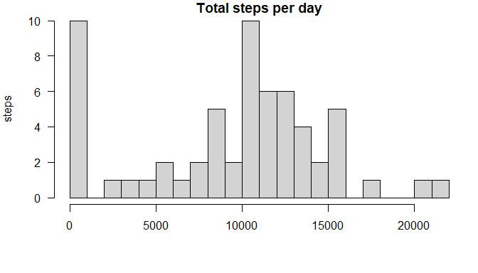
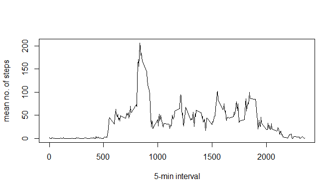
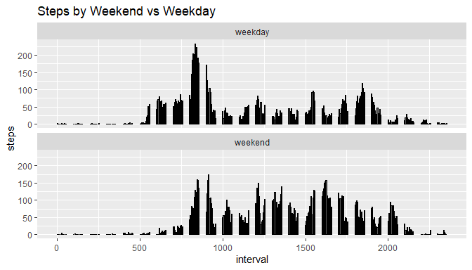

### Load packages and set working directory

```r
library(dplyr)
```

```
## 
## Attaching package: 'dplyr'
```

```
## The following objects are masked from 'package:stats':
## 
##     filter, lag
```

```
## The following objects are masked from 'package:base':
## 
##     intersect, setdiff, setequal, union
```

```r
library(ggplot2)
setwd("~/prof-dev/JHU-Rprogramming/Reproducible-Research/week2")
data <- read.csv("./data/activity.csv")
```

### Convert date to date class

```r
data$date <- as.Date(strptime(data$date, format="%Y-%m-%d"))
```

## Total number of steps per day

```r
dailyTotal <- aggregate(data$steps, by=list(data$date),
                            FUN=sum, na.rm=TRUE)
colnames(dailyTotal) <- c("date", "steps")
```

Here is a histogram of the total number of steps taken each day

```r
par(mar = c(5,4,1,1), las=1)
hist(dailyTotal$steps, breaks = 20,
        main = "Total steps per day", 
        ylab = "steps",
        xlab = "")
```

<!-- -->

### What is mean total number of steps taken per day?

```r
as.integer(mean(dailyTotal$steps, na.rm=TRUE))
```

```
## [1] 9354
```

### What is median total number of steps taken per day?

```r
median(dailyTotal$steps, na.rm=TRUE)
```

```
## [1] 10395
```

## What is the average daily activity pattern? 
Here is a plot:

```r
dailyActivity <- aggregate(data$steps, by=list(data$interval),
                            FUN=mean, na.rm=TRUE)
colnames(dailyActivity) <- c("interval", "steps")
plot(dailyActivity$interval,dailyActivity$steps,
     type = "l",
     xlab = "5-min interval",
     ylab = "mean no. of steps")
```

<!-- -->


The interval with the most steps is 835 

## Imputing missing values
There are 2304 missing values in the data.

Where steps is NA, replace with the median for that 5-minute interval:


```r
#impute.median <- function(x) replace(x, is.na(x), median(x, na.rm = TRUE))
#data %>%
#  group_by(interval) %>%
#  mutate(steps = impute.median(steps))

data %>% 
  group_by(interval) %>% 
  mutate(steps = ifelse(is.na(steps), median(steps, na.rm = TRUE), steps))
```

```
## # A tibble: 17,568 x 3
## # Groups:   interval [288]
##    steps date       interval
##    <int> <date>        <int>
##  1     0 2012-10-01        0
##  2     0 2012-10-01        5
##  3     0 2012-10-01       10
##  4     0 2012-10-01       15
##  5     0 2012-10-01       20
##  6     0 2012-10-01       25
##  7     0 2012-10-01       30
##  8     0 2012-10-01       35
##  9     0 2012-10-01       40
## 10     0 2012-10-01       45
## # ... with 17,558 more rows
```

After updating the daily total number of steps with the imputed data, here is a histogram of the total number of steps taken each day

```r
par(mar = c(5,4,1,1), las=1)
hist(dailyTotal$steps, breaks = 20,
        main = "Total steps per day", 
        ylab = "steps",
        xlab = "")
```

<!-- -->

The mean total number of steps taken per day is 9354

And the median total number of steps taken per day is 10395

My method of imputation has not led to significant changes in the patterns observed before imputation.

## Are there differences in activity patterns between weekdays and weekends?


```r
data$day <- weekdays(data$date)
data$wkday <- factor(ifelse((data$day=="Saturday" |data$day=="Sunday"), "weekend", "weekday"))

wkdayActivity <- group_by(data, interval, wkday) %>% 
  summarize(steps = mean(steps, na.rm = TRUE))
```

```
## `summarise()` has grouped output by 'interval'. You can override using the `.groups` argument.
```

Here is a plot of steps by weekday vs weekend:
<!-- -->
